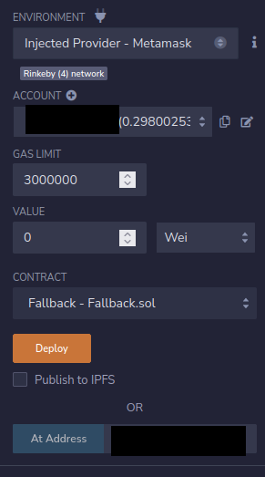

# 01: Fallback

The Ethernaut is a Web3/Solidity based wargame inspired by overthewire.org, played in the Ethereum Virtual Machine, in which each level is based on a smart contract that needs to be "hacked".

This is a sample walkthrough for the level called "Fallback".

## Setup

First off we need a wallet. Get the Metamask Wallet from https://metamask.io/ and choose whichever network works for you ( in my case i will be using Rinkeby's testnet).
Fund the wallet with Chainlink's faucet https://faucets.chain.link/rinkeby and then click on the button "Get new instance" to deploy the contract.

## Steps for completing the level
Click on F12 to get on Developer Tools. You will get something like this:

After a lot of wasted time on Developer Tools, i decided to try my luck on Remix: https://remix.ethereum.org/, where i made some changes in both Fallback.sol and SafeMath.sol. 

Copy the Fallback.sol contract found before "submit instance" and "get new instance" buttons and get SafeMath.sol one from https://github.com/OpenZeppelin/openzeppelin-contracts/blob/master/contracts/utils/math/SafeMath.sol.

At Fallback.sol i made these next changes:
>- <value> 1. Pragma version from **0.6.0** to **0.8.17**
>- <value> 2. Change **"@openzeppelin/contracts/math/SafeMath.sol"** with **"./SafeMath.sol"**
>- <value> 3. There are 3 **"owner = msg.sender"**. Add another **"="**, and all of them should have **"owner == msg.sender"**

And at SafeMath.sol:
>- <value> 1. Pragma version from **0.8.0** to **0.8.17**

Compile both contracts:

Now instead of deploying Fallback.sol we are going to interact with the already deployed contract by using instance address showed on Developer Tools. Dont forget to add your wallet on Environment by selecting "Injected Provider - Metamask".

If we check owner function we can see the owner its the level's address:

There's 2 ways to hack into this smart contract. Firstly, we could build a for loop that sends an x amount that's below 0.001 ether for y amount of times, a function who would access into contribute function. That's too complicated to make, but we can try the second option.

If we want to become the owner of the contract then we have to access the receive function. To access it we need to contribute with an x amount whos lower than 0.001 ether, but also send a transaction with empty calldata. 

Let's use the contribute function. To send an amount lower than 0.001 we are gonna use Wei this time around. Go to https://eth-converter.com/ and insert at ether tab "0.0005", that should 5e14 Wei (or 5 * by 10^14). Paste that into Value tab and then click on the contribute function. Check contribution function by pasting your wallet's address and now you should be able to see your contribution to the contract:

Now, for the empty calldata transaction input 1e17 wei (0.1 eth). Then got to "Low level interactions" section and hit "transact" button. Now if you check the owner call function you can see your wallet's address. Congrats, you managed to hack into this smart contract. Go to withdraw function and withdraw all the funds left.  

Now finish the level by using the submit button at the bottom of the page.

Congrats! See you on to the next level:wave:
